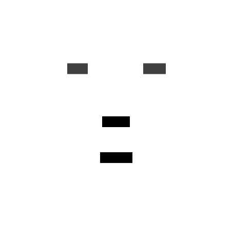
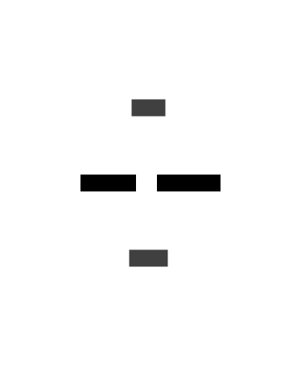
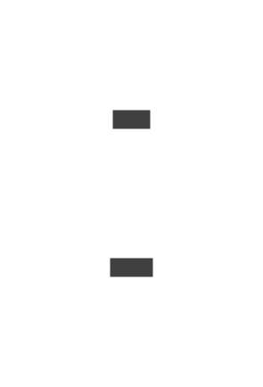
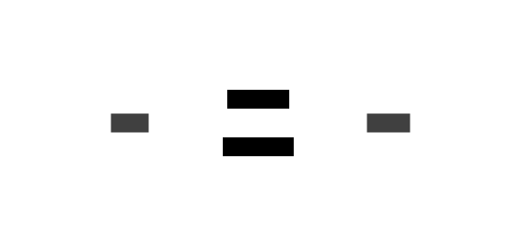

# Sample 01: Minimal Example

This is the simplest possible example with just two actors exchanging messages.

## Input Sequence Diagram

## Transformations

### Default (Detailed Arrows, Vertical Layout)

### Simple Arrows

With `--arrows simple`, bidirectional arrows are used:

### Horizontal Layout

With `--layout horizontal`:

### Dark Theme

With `--theme dark-mauve`:

