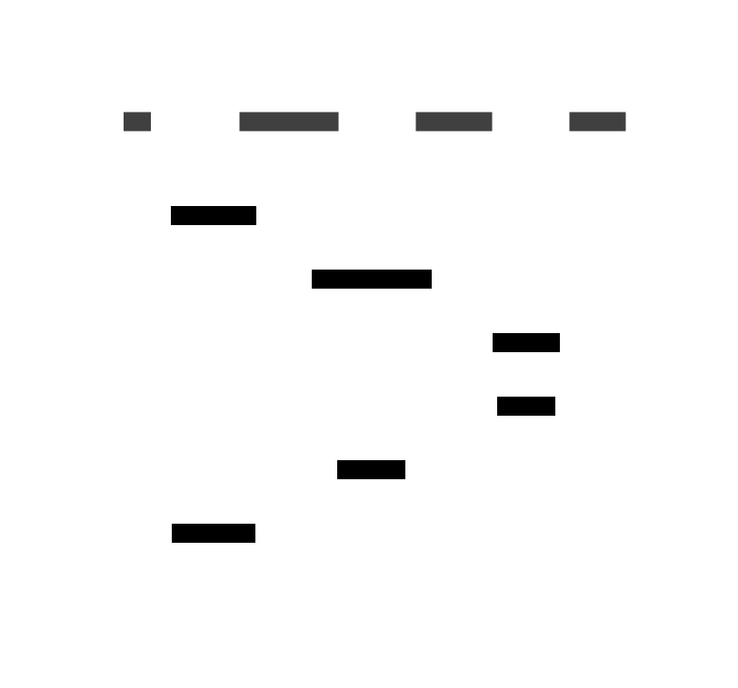
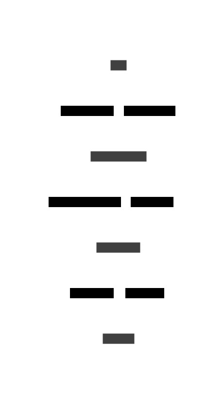
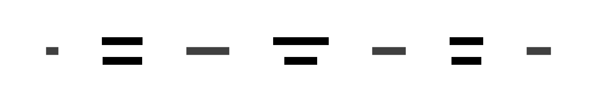

# Sample 02: Basic Authentication Flow

This example shows a typical authentication flow with four actors: User, Web Application, Auth Service, and Database.

## Input Sequence Diagram

## Transformations

### Default (Detailed Arrows, Vertical Layout)

The default transformation shows numbered arrows with different colors for outward (blue) and return (green) messages:

### Simple Arrows

With `--arrows simple`, all communication is represented as bidirectional connections:

### Horizontal Layout

With `--layout horizontal`, the diagram flows left-to-right:

### Vanilla Theme

With `--theme vanilla-nitro` for a different visual style:

