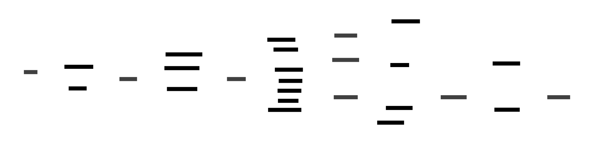

# Sample 03: Microservices Order Processing

This example demonstrates a complex microservices architecture for order processing, involving 8 different services and systems.

## Input Sequence Diagram


## Transformations

### Default (Detailed Arrows, Vertical Layout)

The default transformation preserves all message details with numbered, colored arrows:


### Simple Arrows (High-Level View)

With `--arrows simple`, we get a high-level view of which services communicate:


This view is particularly useful for understanding the overall system connectivity without the detail of individual messages.

### Horizontal Layout

With `--layout horizontal` for a left-to-right flow:



### Cool Theme

With `--theme cool-classics` for a different aesthetic:


## Generated D2 Code

The tool generates clean D2 code. Here's a snippet of the simple arrows version:

```d2
vars: {
  d2-config: {
    theme-id: 0
  }
}

"Customer" <-> "API Gateway"
"API Gateway" <-> "Order Service"
"Order Service" <-> "Inventory Service"
"Inventory Service" <-> "Warehouse System"
"Order Service" <-> "Payment Service"
"Order Service" <-> "Shipping Service"
"Shipping Service" <-> "Warehouse System"
"Order Service" <-> "Notification Service"
"Notification Service" <-> "Customer"
```

The full generated D2 files are available in the build directory.
