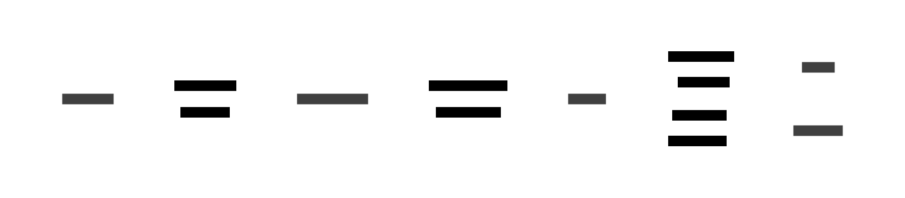

# Sample 04: Multiple Diagrams with Shared Actors

This example demonstrates how seq2boxes handles multiple input sequence diagrams that share common actors (API Server and Cache Service).

## Input Sequence Diagrams

### Frontend Flow


### Backend Flow


## Combined Transformation

When multiple sequence diagrams are provided, seq2boxes:
1. Validates that they share at least one common actor
2. Aligns the common actors in the output
3. Groups messages by their source diagram

### Default Combined Output


### Simple Arrows (Combined)

With `--arrows simple`, showing overall system connectivity:


### Horizontal Layout (Combined)

With `--layout horizontal`:


## Individual Transformations

For comparison, here are the diagrams transformed individually:

### Frontend Only


### Backend Only


## Generated D2 Structure

The combined output creates transparent containers for each diagram's messages:

```d2
diagram_frontend_flow: {
  style.fill: transparent
  style.stroke: transparent
  
  "Browser" -> "Frontend App": "1. Load Page" {
    style.stroke: "#2196f3"
  }
  // ... more messages
}

diagram_backend_flow: {
  style.fill: transparent
  style.stroke: transparent
  
  "Job Scheduler" -> "Background Worker": "101. Trigger Sync Job" {
    style.stroke: "#2196f3"
  }
  // ... more messages
}
```

Note how message indices are offset (1-6 for frontend, 101-108 for backend) to maintain uniqueness.
