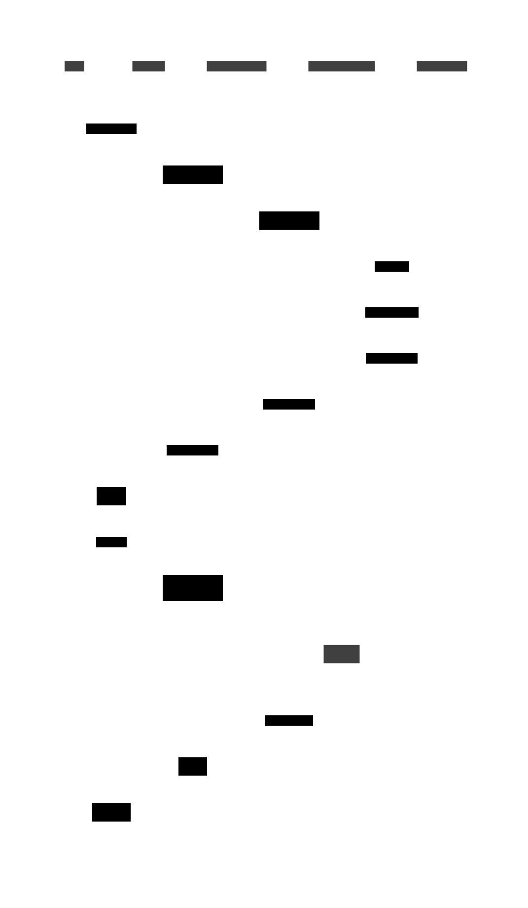
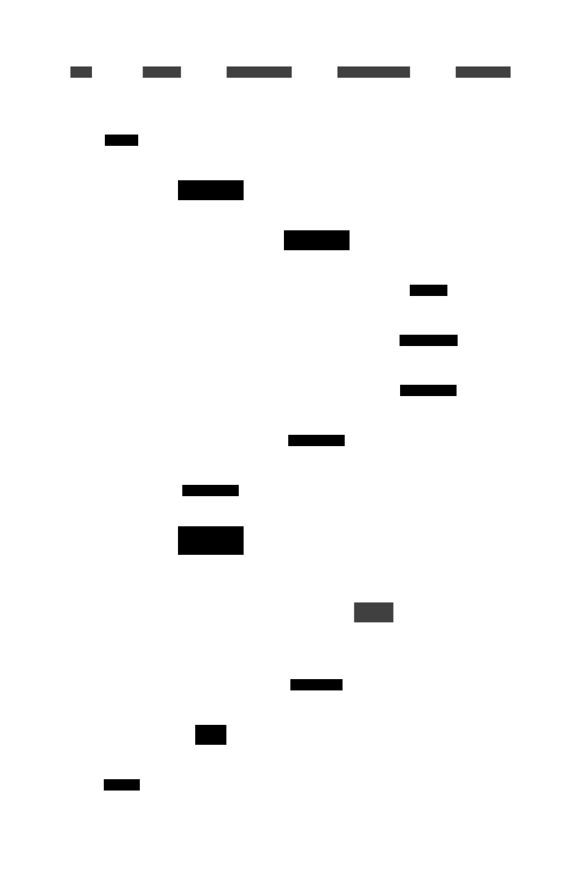
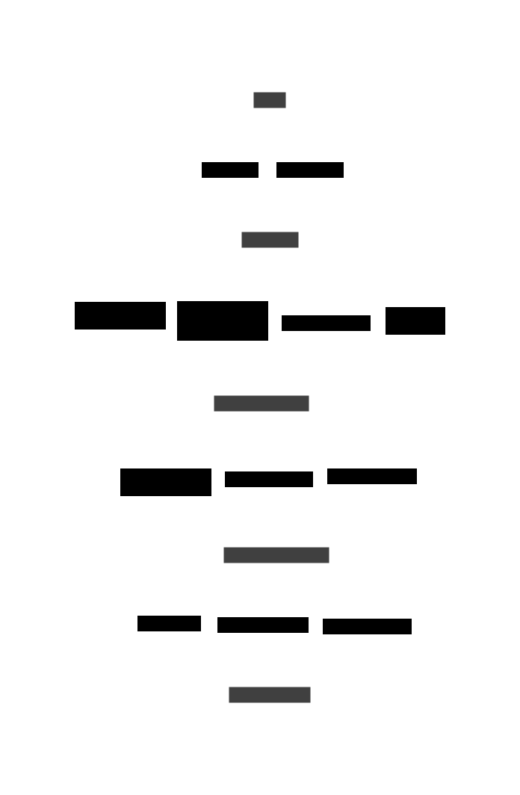
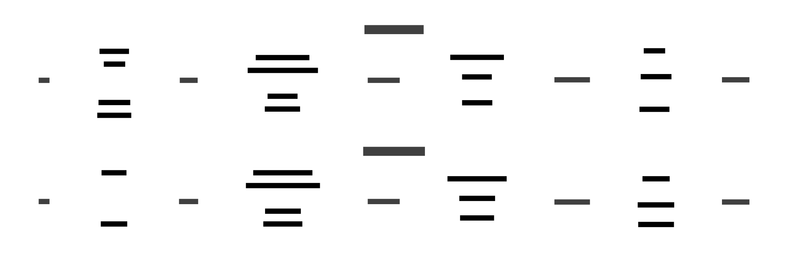
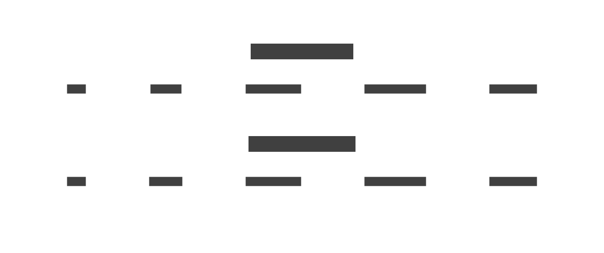
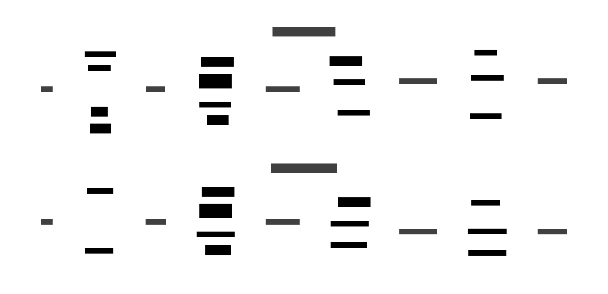

# Sample 05: Complex Nexus Architecture

This example uses real-world Nexus sequence diagrams to demonstrate seq2boxes on complex, production-like scenarios.

## Input Sequence Diagrams

### Nexus A2A (Async-to-Async)


### Nexus MCP (Model Context Protocol)


## Individual Transformations

### A2A as Boxes and Arrows


### MCP as Boxes and Arrows


## Combined Transformations

### Default Combined (Detailed Arrows)

The combined diagram shows how both flows interact with shared actors (Agent, Caller Namespace, Handler Namespace, and Nexus Gateway):



### Simple Arrows (System Overview)

With `--arrows simple`, we get a clear view of the overall system connectivity:



This view clearly shows:
- The Agent connects through different proxies (a2a Proxy vs MCP Proxy)
- Both flows pass through the same core infrastructure
- The bidirectional nature of all communications

### Horizontal Layout

With `--layout horizontal` for a left-to-right flow:



### Flagship Theme

With `--theme flagship-terrastruct` for Terrastruct's signature look:


## Verbose Output

When run with `--verbose`, the tool provides diagnostic information:

```
Parsing sequence diagram from nexus-a2a.d2...
Found 5 actors: agent, a2a-proxy, caller-ns, handler-ns, nexus-gateway
Found 14 messages
Generating boxes and arrows diagram...
```

## Key Features Demonstrated

1. **Actor Alignment**: Common actors (Agent, Caller/Handler Namespaces, Nexus Gateway) are properly aligned across both diagrams
2. **Message Grouping**: Messages from each source diagram are grouped in transparent containers
3. **Index Management**: Message indices are offset (1-14 for a2a, 101-111 for mcp)
4. **Label Handling**: Complex labels with special characters are properly escaped
5. **Theme Support**: Various D2 themes work seamlessly with the generated output

The full generated D2 code is available in `build/boxes-combined.d2` and `build/boxes-combined-simple.d2`.
