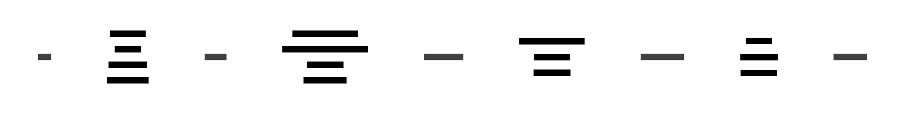
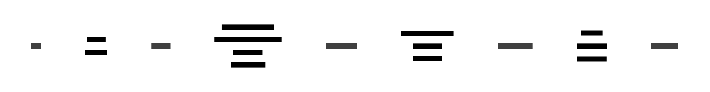

# Sample 05: Complex Nexus Architecture

This example uses real-world Nexus sequence diagrams to demonstrate seq2boxes on complex, production-like scenarios.

## Input Sequence Diagrams

### Nexus A2A (Async-to-Async)


<details>
<summary>D2 Code</summary>

```d2
shape: sequence_diagram
agent: {
  label: Agent
}
a2a-proxy: {
  label: a2a Proxy
}
caller-ns: {
  label: Caller Namespace
}
handler-ns: {
  label: Handler Namespace
}
nexus-gateway: {
  label: Nexus Gateway
}

agent -> a2a-proxy: messages/send
a2a-proxy -> caller-ns: nexus Start\n/service/operation
caller-ns -> handler-ns: nexus Start\n/service/operation
handler-ns -> nexus-gateway: nexus task
nexus-gateway -> handler-ns: start handler wf
nexus-gateway -> handler-ns: operation token
handler-ns -> caller-ns: operation token
caller-ns -> a2a-proxy: operation token
a2a-proxy -> agent: Task ID\n(running)
agent -> a2a-proxy: tasks/get
a2a-proxy -> caller-ns: nexus Get\n/service/operation\n(long poll)
handler-ns."handler wf\ncompletes"
handler-ns -> caller-ns: nexus callback
caller-ns -> a2a-proxy: long poll\nreleased
a2a-proxy -> agent: Task\n(completed)
```
</details>

### Nexus MCP (Model Context Protocol)


<details>
<summary>D2 Code</summary>

```d2
shape: sequence_diagram
agent: {
  label: Agent
}
mcp-proxy: {
  label: MCP Proxy
}
caller-ns: {
  label: Caller Namespace
}
handler-ns: {
  label: Handler Namespace
}
nexus-gateway: {
  label: Nexus Gateway
}

agent -> mcp-proxy: tools/call
mcp-proxy -> caller-ns: nexus Start\n/service/operation
caller-ns -> handler-ns: nexus Start\n/service/operation
handler-ns -> nexus-gateway: nexus task
nexus-gateway -> handler-ns: start handler wf
nexus-gateway -> handler-ns: operation token
handler-ns -> caller-ns: operation token
caller-ns -> mcp-proxy: operation token
mcp-proxy -> caller-ns: nexus Get\n/service/operation\n(long poll)
handler-ns."handler wf\ncompletes"
handler-ns -> caller-ns: nexus callback
caller-ns -> mcp-proxy: long poll\nreleased
mcp-proxy -> agent: tool result
```
</details>

## Individual Transformations

### A2A as Boxes and Arrows



<details>
<summary>Generated D2 Code</summary>

```d2
vars: {
  d2-config: {
    theme-id: 0
  }
}

"Agent" -> "a2a Proxy": "1. messages/send" {
  style.stroke: "#2196f3"
}
"a2a Proxy" -> "Caller Namespace": "2. nexus Start\n/service/operation" {
  style.stroke: "#2196f3"
}
"Caller Namespace" -> "Handler Namespace": "3. nexus Start\n/service/operation" {
  style.stroke: "#2196f3"
}
"Handler Namespace" -> "Nexus Gateway": "4. nexus task" {
  style.stroke: "#2196f3"
}
"Nexus Gateway" -> "Handler Namespace": "5. start handler wf" {
  style.stroke: "#2196f3"
}
"Nexus Gateway" -> "Handler Namespace": "6. operation token" {
  style.stroke: "#4caf50"
  style.stroke-width: 2
}
"Handler Namespace" -> "Caller Namespace": "7. operation token" {
  style.stroke: "#4caf50"
  style.stroke-width: 2
}
"Caller Namespace" -> "a2a Proxy": "8. operation token" {
  style.stroke: "#4caf50"
  style.stroke-width: 2
}
"a2a Proxy" -> "Agent": "9. Task ID\n(running)" {
  style.stroke: "#2196f3"
}
"Agent" -> "a2a Proxy": "10. tasks/get" {
  style.stroke: "#2196f3"
}
"a2a Proxy" -> "Caller Namespace": "11. nexus Get\n/service/operation\n(long poll)" {
  style.stroke: "#2196f3"
}
"Handler Namespace" -> "Caller Namespace": "12. nexus callback" {
  style.stroke: "#4caf50"
  style.stroke-width: 2
}
"Caller Namespace" -> "a2a Proxy": "13. long poll\nreleased" {
  style.stroke: "#2196f3"
}
"a2a Proxy" -> "Agent": "14. Task\n(completed)" {
  style.stroke: "#4caf50"
  style.stroke-width: 2
}
```
</details>

### MCP as Boxes and Arrows



<details>
<summary>Generated D2 Code</summary>

```d2
vars: {
  d2-config: {
    theme-id: 0
  }
}

"Agent" -> "MCP Proxy": "1. tools/call" {
  style.stroke: "#2196f3"
}
"MCP Proxy" -> "Caller Namespace": "2. nexus Start\n/service/operation" {
  style.stroke: "#2196f3"
}
"Caller Namespace" -> "Handler Namespace": "3. nexus Start\n/service/operation" {
  style.stroke: "#2196f3"
}
"Handler Namespace" -> "Nexus Gateway": "4. nexus task" {
  style.stroke: "#2196f3"
}
"Nexus Gateway" -> "Handler Namespace": "5. start handler wf" {
  style.stroke: "#2196f3"
}
"Nexus Gateway" -> "Handler Namespace": "6. operation token" {
  style.stroke: "#4caf50"
  style.stroke-width: 2
}
"Handler Namespace" -> "Caller Namespace": "7. operation token" {
  style.stroke: "#4caf50"
  style.stroke-width: 2
}
"Caller Namespace" -> "MCP Proxy": "8. operation token" {
  style.stroke: "#4caf50"
  style.stroke-width: 2
}
"MCP Proxy" -> "Caller Namespace": "9. nexus Get\n/service/operation\n(long poll)" {
  style.stroke: "#2196f3"
}
"Handler Namespace" -> "Caller Namespace": "10. nexus callback" {
  style.stroke: "#4caf50"
  style.stroke-width: 2
}
"Caller Namespace" -> "MCP Proxy": "11. long poll\nreleased" {
  style.stroke: "#2196f3"
}
"MCP Proxy" -> "Agent": "12. tool result" {
  style.stroke: "#4caf50"
  style.stroke-width: 2
}
```
</details>

## Combined Transformations

### Default Combined (Detailed Arrows)

The combined diagram shows how both flows interact with shared actors (Agent, Caller Namespace, Handler Namespace, and Nexus Gateway):


<details>
<summary>Generated D2 Code</summary>

```d2
vars: {
  d2-config: {
    theme-id: 0
  }
}


# Messages from nexus-a2a.d2
diagram_nexus_a2a: {
  style.fill: transparent
  style.stroke: transparent
  "Agent" -> "a2a Proxy": "1. messages/send" {
    style.stroke: "#2196f3"
  }
  "a2a Proxy" -> "Caller Namespace": "2. nexus Start\n/service/operation" {
    style.stroke: "#2196f3"
  }
  "Caller Namespace" -> "Handler Namespace": "3. nexus Start\n/service/operation" {
    style.stroke: "#2196f3"
  }
  "Handler Namespace" -> "Nexus Gateway": "4. nexus task" {
    style.stroke: "#2196f3"
  }
  "Nexus Gateway" -> "Handler Namespace": "5. start handler wf" {
    style.stroke: "#2196f3"
  }
  "Nexus Gateway" -> "Handler Namespace": "6. operation token" {
    style.stroke: "#4caf50"
    style.stroke-width: 2
  }
  "Handler Namespace" -> "Caller Namespace": "7. operation token" {
    style.stroke: "#4caf50"
    style.stroke-width: 2
  }
  "Caller Namespace" -> "a2a Proxy": "8. operation token" {
    style.stroke: "#4caf50"
    style.stroke-width: 2
  }
  "a2a Proxy" -> "Agent": "9. Task ID\n(running)" {
    style.stroke: "#2196f3"
  }
  "Agent" -> "a2a Proxy": "10. tasks/get" {
    style.stroke: "#2196f3"
  }
  "a2a Proxy" -> "Caller Namespace": "11. nexus Get\n/service/operation\n(long poll)" {
    style.stroke: "#2196f3"
  }
  "Handler Namespace" -> "Caller Namespace": "12. nexus callback" {
    style.stroke: "#4caf50"
    style.stroke-width: 2
  }
  "Caller Namespace" -> "a2a Proxy": "13. long poll\nreleased" {
    style.stroke: "#2196f3"
  }
  "a2a Proxy" -> "Agent": "14. Task\n(completed)" {
    style.stroke: "#4caf50"
    style.stroke-width: 2
  }
}

# Messages from nexus-mcp.d2
diagram_nexus_mcp: {
  style.fill: transparent
  style.stroke: transparent
  "Agent" -> "MCP Proxy": "1001. tools/call" {
    style.stroke: "#2196f3"
  }
  "MCP Proxy" -> "Caller Namespace": "1002. nexus Start\n/service/operation" {
    style.stroke: "#2196f3"
  }
  "Caller Namespace" -> "Handler Namespace": "1003. nexus Start\n/service/operation" {
    style.stroke: "#2196f3"
  }
  "Handler Namespace" -> "Nexus Gateway": "1004. nexus task" {
    style.stroke: "#2196f3"
  }
  "Nexus Gateway" -> "Handler Namespace": "1005. start handler wf" {
    style.stroke: "#2196f3"
  }
  "Nexus Gateway" -> "Handler Namespace": "1006. operation token" {
    style.stroke: "#4caf50"
    style.stroke-width: 2
  }
  "Handler Namespace" -> "Caller Namespace": "1007. operation token" {
    style.stroke: "#4caf50"
    style.stroke-width: 2
  }
  "Caller Namespace" -> "MCP Proxy": "1008. operation token" {
    style.stroke: "#4caf50"
    style.stroke-width: 2
  }
  "MCP Proxy" -> "Caller Namespace": "1009. nexus Get\n/service/operation\n(long poll)" {
    style.stroke: "#2196f3"
  }
  "Handler Namespace" -> "Caller Namespace": "1010. nexus callback" {
    style.stroke: "#4caf50"
    style.stroke-width: 2
  }
  "Caller Namespace" -> "MCP Proxy": "1011. long poll\nreleased" {
    style.stroke: "#2196f3"
  }
  "MCP Proxy" -> "Agent": "1012. tool result" {
    style.stroke: "#4caf50"
    style.stroke-width: 2
  }
}
```
</details>

### Simple Arrows (System Overview)

With `--arrows simple`, we get a clear view of the overall system connectivity:


<details>
<summary>Generated D2 Code</summary>

```d2
vars: {
  d2-config: {
    theme-id: 0
  }
}


# Messages from nexus-a2a.d2
diagram_nexus_a2a: {
  style.fill: transparent
  style.stroke: transparent
  "Agent" <-> "a2a Proxy"
  "a2a Proxy" <-> "Caller Namespace"
  "Caller Namespace" <-> "Handler Namespace"
  "Handler Namespace" <-> "Nexus Gateway"
}

# Messages from nexus-mcp.d2
diagram_nexus_mcp: {
  style.fill: transparent
  style.stroke: transparent
  "Agent" <-> "MCP Proxy"
  "MCP Proxy" <-> "Caller Namespace"
  "Caller Namespace" <-> "Handler Namespace"
  "Handler Namespace" <-> "Nexus Gateway"
}
```
</details>

This view clearly shows:
- The Agent connects through different proxies (a2a Proxy vs MCP Proxy)
- Both flows pass through the same core infrastructure
- The bidirectional nature of all communications

### Horizontal Layout

With `--layout horizontal` for a left-to-right flow:


<details>
<summary>Generated D2 Code</summary>

```d2
vars: {
  d2-config: {
    theme-id: 0
  }
}

direction: right


# Messages from nexus-a2a.d2
diagram_nexus_a2a: {
  style.fill: transparent
  style.stroke: transparent
  "Agent" -> "a2a Proxy": "1. messages/send" {
    style.stroke: "#2196f3"
  }
  "a2a Proxy" -> "Caller Namespace": "2. nexus Start\n/service/operation" {
    style.stroke: "#2196f3"
  }
  "Caller Namespace" -> "Handler Namespace": "3. nexus Start\n/service/operation" {
    style.stroke: "#2196f3"
  }
  "Handler Namespace" -> "Nexus Gateway": "4. nexus task" {
    style.stroke: "#2196f3"
  }
  "Nexus Gateway" -> "Handler Namespace": "5. start handler wf" {
    style.stroke: "#2196f3"
  }
  "Nexus Gateway" -> "Handler Namespace": "6. operation token" {
    style.stroke: "#4caf50"
    style.stroke-width: 2
  }
  "Handler Namespace" -> "Caller Namespace": "7. operation token" {
    style.stroke: "#4caf50"
    style.stroke-width: 2
  }
  "Caller Namespace" -> "a2a Proxy": "8. operation token" {
    style.stroke: "#4caf50"
    style.stroke-width: 2
  }
  "a2a Proxy" -> "Agent": "9. Task ID\n(running)" {
    style.stroke: "#2196f3"
  }
  "Agent" -> "a2a Proxy": "10. tasks/get" {
    style.stroke: "#2196f3"
  }
  "a2a Proxy" -> "Caller Namespace": "11. nexus Get\n/service/operation\n(long poll)" {
    style.stroke: "#2196f3"
  }
  "Handler Namespace" -> "Caller Namespace": "12. nexus callback" {
    style.stroke: "#4caf50"
    style.stroke-width: 2
  }
  "Caller Namespace" -> "a2a Proxy": "13. long poll\nreleased" {
    style.stroke: "#2196f3"
  }
  "a2a Proxy" -> "Agent": "14. Task\n(completed)" {
    style.stroke: "#4caf50"
    style.stroke-width: 2
  }
}

# Messages from nexus-mcp.d2
diagram_nexus_mcp: {
  style.fill: transparent
  style.stroke: transparent
  "Agent" -> "MCP Proxy": "1001. tools/call" {
    style.stroke: "#2196f3"
  }
  "MCP Proxy" -> "Caller Namespace": "1002. nexus Start\n/service/operation" {
    style.stroke: "#2196f3"
  }
  "Caller Namespace" -> "Handler Namespace": "1003. nexus Start\n/service/operation" {
    style.stroke: "#2196f3"
  }
  "Handler Namespace" -> "Nexus Gateway": "1004. nexus task" {
    style.stroke: "#2196f3"
  }
  "Nexus Gateway" -> "Handler Namespace": "1005. start handler wf" {
    style.stroke: "#2196f3"
  }
  "Nexus Gateway" -> "Handler Namespace": "1006. operation token" {
    style.stroke: "#4caf50"
    style.stroke-width: 2
  }
  "Handler Namespace" -> "Caller Namespace": "1007. operation token" {
    style.stroke: "#4caf50"
    style.stroke-width: 2
  }
  "Caller Namespace" -> "MCP Proxy": "1008. operation token" {
    style.stroke: "#4caf50"
    style.stroke-width: 2
  }
  "MCP Proxy" -> "Caller Namespace": "1009. nexus Get\n/service/operation\n(long poll)" {
    style.stroke: "#2196f3"
  }
  "Handler Namespace" -> "Caller Namespace": "1010. nexus callback" {
    style.stroke: "#4caf50"
    style.stroke-width: 2
  }
  "Caller Namespace" -> "MCP Proxy": "1011. long poll\nreleased" {
    style.stroke: "#2196f3"
  }
  "MCP Proxy" -> "Agent": "1012. tool result" {
    style.stroke: "#4caf50"
    style.stroke-width: 2
  }
}
```
</details>

### Flagship Theme

With `--theme flagship-terrastruct` for Terrastruct's signature look:


<details>
<summary>Generated D2 Code</summary>

```d2
vars: {
  d2-config: {
    theme-id: 0
  }
}


# Messages from nexus-a2a.d2
diagram_nexus_a2a: {
  style.fill: transparent
  style.stroke: transparent
  "Agent" -> "a2a Proxy": "1. messages/send" {
    style.stroke: "#2196f3"
  }
  "a2a Proxy" -> "Caller Namespace": "2. nexus Start\n/service/operation" {
    style.stroke: "#2196f3"
  }
  "Caller Namespace" -> "Handler Namespace": "3. nexus Start\n/service/operation" {
    style.stroke: "#2196f3"
  }
  "Handler Namespace" -> "Nexus Gateway": "4. nexus task" {
    style.stroke: "#2196f3"
  }
  "Nexus Gateway" -> "Handler Namespace": "5. start handler wf" {
    style.stroke: "#2196f3"
  }
  "Nexus Gateway" -> "Handler Namespace": "6. operation token" {
    style.stroke: "#4caf50"
    style.stroke-width: 2
  }
  "Handler Namespace" -> "Caller Namespace": "7. operation token" {
    style.stroke: "#4caf50"
    style.stroke-width: 2
  }
  "Caller Namespace" -> "a2a Proxy": "8. operation token" {
    style.stroke: "#4caf50"
    style.stroke-width: 2
  }
  "a2a Proxy" -> "Agent": "9. Task ID\n(running)" {
    style.stroke: "#2196f3"
  }
  "Agent" -> "a2a Proxy": "10. tasks/get" {
    style.stroke: "#2196f3"
  }
  "a2a Proxy" -> "Caller Namespace": "11. nexus Get\n/service/operation\n(long poll)" {
    style.stroke: "#2196f3"
  }
  "Handler Namespace" -> "Caller Namespace": "12. nexus callback" {
    style.stroke: "#4caf50"
    style.stroke-width: 2
  }
  "Caller Namespace" -> "a2a Proxy": "13. long poll\nreleased" {
    style.stroke: "#2196f3"
  }
  "a2a Proxy" -> "Agent": "14. Task\n(completed)" {
    style.stroke: "#4caf50"
    style.stroke-width: 2
  }
}

# Messages from nexus-mcp.d2
diagram_nexus_mcp: {
  style.fill: transparent
  style.stroke: transparent
  "Agent" -> "MCP Proxy": "1001. tools/call" {
    style.stroke: "#2196f3"
  }
  "MCP Proxy" -> "Caller Namespace": "1002. nexus Start\n/service/operation" {
    style.stroke: "#2196f3"
  }
  "Caller Namespace" -> "Handler Namespace": "1003. nexus Start\n/service/operation" {
    style.stroke: "#2196f3"
  }
  "Handler Namespace" -> "Nexus Gateway": "1004. nexus task" {
    style.stroke: "#2196f3"
  }
  "Nexus Gateway" -> "Handler Namespace": "1005. start handler wf" {
    style.stroke: "#2196f3"
  }
  "Nexus Gateway" -> "Handler Namespace": "1006. operation token" {
    style.stroke: "#4caf50"
    style.stroke-width: 2
  }
  "Handler Namespace" -> "Caller Namespace": "1007. operation token" {
    style.stroke: "#4caf50"
    style.stroke-width: 2
  }
  "Caller Namespace" -> "MCP Proxy": "1008. operation token" {
    style.stroke: "#4caf50"
    style.stroke-width: 2
  }
  "MCP Proxy" -> "Caller Namespace": "1009. nexus Get\n/service/operation\n(long poll)" {
    style.stroke: "#2196f3"
  }
  "Handler Namespace" -> "Caller Namespace": "1010. nexus callback" {
    style.stroke: "#4caf50"
    style.stroke-width: 2
  }
  "Caller Namespace" -> "MCP Proxy": "1011. long poll\nreleased" {
    style.stroke: "#2196f3"
  }
  "MCP Proxy" -> "Agent": "1012. tool result" {
    style.stroke: "#4caf50"
    style.stroke-width: 2
  }
}
```
</details>

## Verbose Output

When run with `--verbose`, the tool provides diagnostic information:

```
Converting 1 diagram(s)
Layout: vertical, Arrow mode: detailed
Parsed nexus-a2a.d2: 5 actors, 14 messages
Conversion complete
```

## Key Features Demonstrated

1. **Actor Alignment**: Common actors (Agent, Caller/Handler Namespaces, Nexus Gateway) are properly aligned across both diagrams
2. **Message Grouping**: Messages from each source diagram are grouped in transparent containers
3. **Index Management**: Message indices are offset (1-14 for a2a, 101-111 for mcp)
4. **Label Handling**: Complex labels with special characters are properly escaped
5. **Theme Support**: Various D2 themes work seamlessly with the generated output
